# Azure Cosmos DB for Multitenant Applications Workshop

## Azure Cosmos DB Introduction

Azure Cosmos DB is a fully managed NoSQL database for modern multitenant application development. You can build applications 
fast with open source APIs, multiple SDKs, schemaless data and no-ETL analytics over operational data.
Single-digit millisecond response times, and instant scalability, guarantee speed at any scale.
Guarantee business continuity, 99.999% availability and enterprise-grade security for every application.
End-to-end database management, with serverless and automatic scaling matching your application and TCO needs. 
Supports multiple database APIs including native API for NoSQL, API for Mongo DB, Apache Cassandra, Apache Gremlin and Table.
It also started supporting PostgreSQL extended with the Citus Open Source which is useful for highly scalable relational apps.

To begin using Azure Cosmos DB, create an Azure Cosmos DB account in an Azure resource group in your subscription. 
You then create databases and containers within the account.

#### Resource Model:
A single Azure Cosmos DB account can virtually manage an unlimited amount of data and provisioned throughput. 
To manage your data and provisioned throughput, you can create one or more databases within your account, 
then one or more containers to store your data. 


#### Request Units: 
Cost of database operations is normalized by Azure Cosmos DB and is experssed by Request Units (RU). It is a performance 
currency abstracting the system resources such as CPU, IOPS and Memory to perform the database operations supported by 
Azure Cosmos DB. You can examine the response header to track the number of RUs that are consumed by any database 
operation.


#### Indexing: 
Azure Cosmos DB is a schema-agnostic database that allows you to iterate on your application without having to deal with schema 
or index management. By default, Azure Cosmos DB automatically indexes every property for all items in your container without 
having to define any schema or configure secondary indexes. When an item is written, Azure Cosmos DB effectively indexes each 
property's path and its corresponding value. In some situations, you may want to override this automatic behavior to better 
suit your requirements. You can customize a container's indexing policy by setting its indexing mode, and include or exclude 
property paths.

Access [Azure Cosmos DB Documentation](https://learn.microsoft.com/azure/cosmos-db/introduction) for more details and training. 

## Why Azure Cosmos DB?
Here are the scenarios where Azure Cosmos DB can help:
* Looking to modernize their monolithic onpremise applications as SaaS applications.
* scale up to the max throughput for addressing unpredicted workloads and scale down automatically.
* Goals to expand globally with low latency and highly scalable throughput. 
* Trying to reduce costs to support multiple customers with fluctuating throughput requirement.
* Application needs to support multiple businesses with flexible schema.
* Unable to meet performance SLA requirements and reaching max storage limits with growing data.

All the above use cases need a new mindset and special features. This workshop will show you how Azure Cosmos DB will be the best option.


## Workshop Challenge List
- [Challenge-1: Deploy Azure Storage, Azure Cosmos DB & Azure Data Factory Services to Azure Subscription](#challenge-1-Deploy-Azure-Services)
- [Challenge-2: Model data to build SaaS applications](#Challenge-2-Model-data-to-build-SaaS-applications)
- [Challenge-3: Design Cosmos DB Account to serve small, medium and large customers](#Challenge-3-Design-Cosmos-DB-Account-to-serve-small-medium-and-large-customers)
- [Challenge-4: Validate Cosmos DB features Auto Failover, Autoscale and Low Latency](#Challenge-4-Validate-Cosmos-DB-features-Auto-failover-Autoscale-and-Low-latency)
- [Challenge-5: Optimize costs and performance with Indexing Policy](#Challenge-5-Optimize-costs-and-performance-with-Indexing-Policy)
- [Challenge-6: Load multi-tenant data into Cosmos DB with an application](#Challenge-6-Load-multi-tenant-data-into-Cosmos-DB-with-an-application)

## Multi-Tenancy features for Software Companies 

### Distributes Data horizontally
By using partitions with Azure Cosmos DB containers, you can create containers that are shared across multiple tenants. 
With large containers, Azure Cosmos DB spreads your tenants across multiple physical nodes to achieve a high degree of scale.

### Control Throughput based on the size of the customer to lower your costs: 
Typically, you provision a defined number of request units per second for your workload, which is referred 
to as throughput. You can assign throughput at a container level, at a database level to share among the containers, automatically
scale up to the max throughput for address unpredicted workloads and scale down to 10% of Max to save costs.

    
## Business Scenario
Fictitious ISV company called "Smart Booking Inc" has built an on-line reservation application called "EasyReserveApp" and 
currently deployed as on-premises application to 7 customers in Car Rental and Hotel business industries. This application is a 
hit in the industry and they want to convert as a SaaS application to meet the global demand. They are looking for a database to 
handle unpredictable volume, maintain low latency response to users at any part of the world, optimized the costs based on the usage
and maintain high availability & business continuity. 

It currently has the following clients in Car Rental and Hotel Industry:


This workshop covers how Azure Cosmos DB can be designed to support small, medium and large customers using this use case..  


## Architecture Solution Diagram
 


## Challenge-1: Deploy Azure Services  

We have developed an Azure Deployment script to provision the required Azure Services used in the above architecture diagram.

1.1 Click the "Deploy to Azure" button

[](https://portal.azure.com/#create/Microsoft.Template/uri/https%3A%2F%2Fraw.githubusercontent.com%2Fmicrosoft%2FCosmosDB_Multi-Tenant%2Fmain%2Fazuredeploy.json)

1.2. It display a custom deployment screen as shown below.

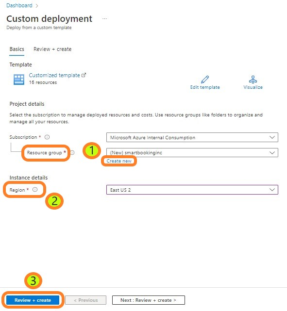
	
1.3 Select 'Create new' button and enter 'smartbooking' as the resource group name.

1.4 Select your region from the dropdown list for example "East US 2".

1.5 Click on "Review+create" button.

1.6 It completes the validation as the next step and click on 'create' button.

It will create the following services in your subscription:
* Azure Cosmos DB with 4 containers

It may take 2 to 5 minutes to create the services.

1.7 Click on "Go to resource group" when the deployment is complete.


It will take you to your resource group showing the installed services.


You have successfully deployed the required services to Azure. Congratulations for completing your first challenge.

## Challenge-2: Model data to build SaaS applications
Let us review the object model for this application and plan the data model for SaaS application.

### Multi-Tenant Reservation System Object Model
**Tenant** object stores all the business customer data.

**Biz Locations** contains the tenant business locations address and contact info.

**Hotel_Room** contains catalog of rooms details for offering.
**Rental_Car** contains catalog of cars details for offering.
**Room_Inventory** maintains availability for each hotel business locations.
**Rental_Car_Inventory** maintains availability for each rental car business locations.
**Customers** maintains all the customer profile data.
**Car_Rental_Reservations** stores all the car rental reservations. 
**Hotel_Reservations** stores all the hotel reservations. 


### Access Patterns
You would want to keep all the relevant data in one object based on the following common access patterns to write and read data.
1) Hotel Room & Rental Car availability to support customer search based on location, dates and room/car types.
2) Update the availability after the customer completes the reservation.
3) Customer reviews the reservation. 
4) Business Owners and Support Team access the reservations for their location. 

You may want to create two document models. One to keep Reservation info and the other one to keep availability info.

* Customer searches for the availability using the availability_doc. 
* Reservation data will be inserted as soon as customer completes the reservation booking. 
* Customers, Hotel Managers, Hotel support team can access the reservation at anytime.

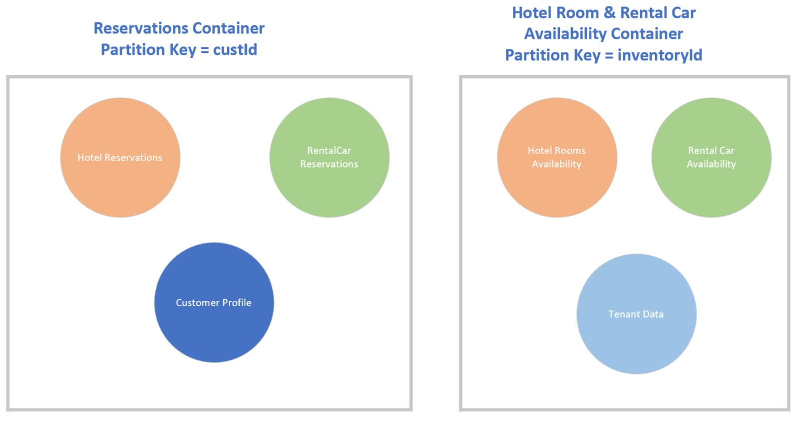

## Challenge-3: Design Cosmos DB Account to serve small, medium and large customers

Access Repo's **Data folder** and find the following data objects in JSON format.


Check out the CSV files and understand that the flat data does not work for SaaS model.
Think about ways to group the data into the two documents models you have identified. 
**Download all the files into your local folder.**

### Database Strategies to support small, medium and large customers

#### 1) Shared container with partition keys per tenant
When you use a single container for multiple tenants, you can make use of Azure Cosmos DB partitioning support. 
By using separate partition keys for each tenant, you can easily query the data for a single tenant.
This approach tends to work well when the amount of data stored for each tenant is small. It can be a good choice for 
building a pricing model that includes a free tier, and for business-to-consumer (B2C) solutions. 
In general, by using shared containers, you achieve the highest density of tenants and therefore the lowest price per tenant.

#### 2) Container per tenant
You can provision dedicated containers for each tenant. This can work well for isolating the customer tenant data.
When using a container for each tenant, you can consider sharing throughput at the database level. You can provision dedicated 
throughput for guaranteed level of performance, serve medium size customers, to avoid noisy neighbor problem. 

#### 3) Account for tenant
You can provision separate database accounts for each tenant, which provides the highest level of isolation, 
but the lowest density. A single database account is dedicated to a tenant, which means they are not subject to 
the noisy neighbor problem. You can also configure the location of the container data via replication according to the 
tenant's requirements, and you can tune the configuration of Azure Cosmos DB features, network access, backup policy, 
geo-replication and customer-managed encryption keys, to suit each tenant's requirements.

#### 4) Hybrid Approaches
You can consider a combination of the above approaches to suit different tenants' requirements and your pricing model. 
For example:
* Provision all free trial customers within a shared container, and use the tenant ID or a synthetic key partition key.
* Offer a higher Silver tier that provisions dedicated throughput for the tenant's container.
* Offer the highest Gold tier, and provide a dedicated database account for the tenant, which also allows tenants to 
select the geography for their deployment.


### Right strategy to load availability data 
**Requirement**:

* Support customer client (end customer) search by date, location and inventory type (Rental Car & Hotel Room Type)
* Customer support team from each business should be able to search for availability to help with reservations. 
* Customer manager should be able to load the availability data every month. 

Consider the option of loading the rental car and hotel room data with inventory type as the parition key. Another option 
is to load the data per business location using business location id. 

#### Scale database throughput to bulk load the data without rate limit error
Expand **SaaS_Multitenant_DB** database and select **Scale** section.
Keep Autoscale option and set the Max RU/s to 11000 units.
Select **Save** to complete the operation.

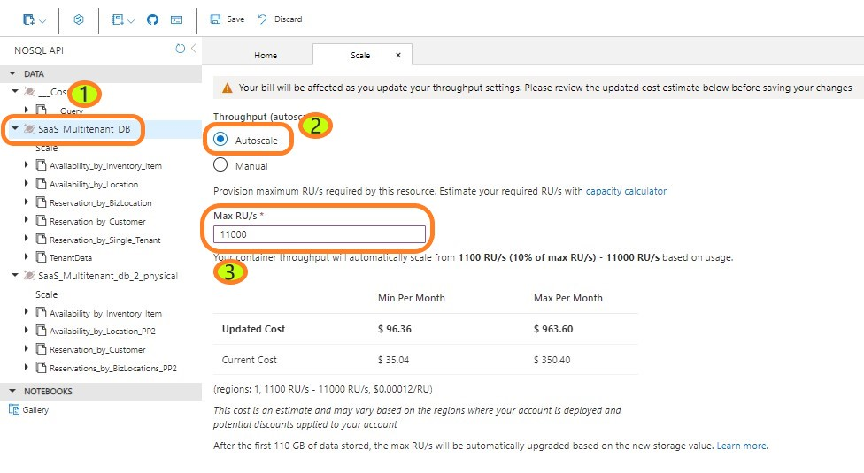

#### 3.1 Load the Reservation availability data into a container with **InventoryId** as the partition Key.
Access the data in your local folder to load the data.

#### Load Hotel Room availability data

* Select Data Explorer from the left panel.
* Expand 'Availability_by_inventory_item' container and select 'items' section. 
* Select 'Upload Item' button on the top right tabs.
* Select the 'Folder' icon to load the data.
* Select 'Hotel_room_availability.json' file you have downloaded from the github site.
* Hit the "Upload" button to load the data. 
It will take 2 to 3 minutes based on the RU setting.

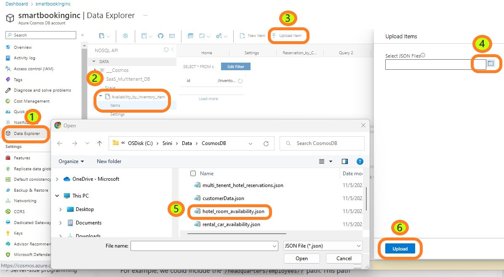

#### Load Rental Car availability data

* Repeat the same to load Rental Car data from "rental_car_availability.json".

#### Load Tenant Data 

* Repeat the same to load tenant data from 'tenantData.json'.


3.2 Load the Rental Car and Hotel Room availability data into 'Availability_by_BizLocation' container with 
Business location Id (tBizLoc) as the partition key.

* Expand 'Availability_by_inventory_item' container and select 'items' section. 
* Repeat the steps of 3.1 to load Rental Car and Hotel room availabiity data.

3.3 Analyze Query performance to satisfy read and write requirement

Expand 'Availability_by_inventory_item' container and select items section
Select 'windows with + sign' from the options on the top section.

Copy and paste the following query in a SQL Editor to search for **Compact** cars between 11/11 and 11/14 
in 'San Francisco' city.

Execute the query from the options on the top section.

```
SELECT *
FROM c where c.availDate >'2022-11-11' and c.availDate <'2022-11-14' 
and c.availableCars > 0 and c.inventoryId=4 and c.bizAddress.city='San Francisco'

```

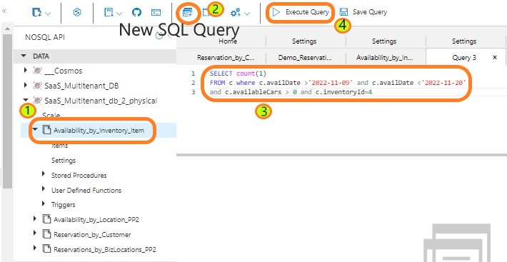

Repeat the same query in 'Availability_by_Location' container by following the above steps.

Compare the "Request charge" and "Query Engine Execution time". You can recognize the value of 
right partitioning key. Since volume of the end customer queries are much more than the business support 
team and the managers, InventoryId would be the best partition key. 


### Right strategy to load reservation data
**Requirement**:

* Application need to complete the reservation booking transaction.
* Customer client should be able to review the reservations at anytime. 
* Business support team should be able to pull up the reservation to help the client requests.
* Transaction should be able to update the avilability count. 
* Business manager should be able to pull the total reservations per day 

Consider the advantages of loading the reservation data with customerId as the partition key vs loading the data with 
Business location as the partition key.

3.4 Load the reservation data into the container with **customerId** as the partition key.

* Expand 'Reservation_by_Customer' container and select 'items' section. 
* Repeat the steps of 3.1 to load Rental Car and Hotel room reservation data 
from the following files:
	1) multi_tenent_car_reservations.json
	2) multi_tenent_hotel_reservations.json
	3) customerData.json

3.5 Load the reservation data into the container with **Business location (syntheticKey)** as the partition key. 

* Expand 'Reservation_by_BizLocation' container and select 'items' section. 
* Repeat the steps of 3.1 to load Rental Car and Hotel room reservation data 
from the following files:
	1) multi_tenent_car_reservations.json
	2) multi_tenent_hotel_reservations.json
	3) customerData.json

#### Scale down the database throughput to save costs. Very critical and very important step! 
Expand **SaaS_Multitenant_DB** database and select **Scale** section.
Keep Autoscale option and set the Max RU/s to 4000 units.
Select **Save** to complete the operation.

3.6 Analyze the query performance to satisfy read and write requirement.

Expand **Reservation_by_Customer** container and select **Items** section.
Create a new SQL Query window and paste the folowing query

```
select * from c where c.custId=3286

```

Execute the query from the options on the top section. 


Execute the same query by creating a **Reservation_by_BizLocation** container's SQL Query window by following the 
above steps.

Evaluate **Request Charge** and **Query engine excution time** values based on customerId and Business location 
partition keys. You would see the value of using the right partition key for the high volume queries. 


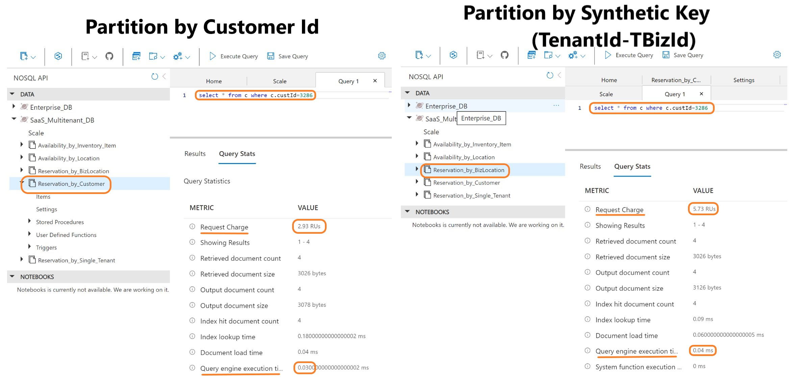


## Challenge-4: Validate Cosmos DB features Auto failover, Autoscale and Low latency


### 4.1 High Availability Features:
Azure Cosmos DB is designed to provide multiple features and configuration options to achieve high availability for all 
solution availability needs.

### Replica Outages
Replica outages refer to outages of individual nodes in an Azure Cosmos DB cluster deployed in an 
Azure region. Azure Cosmos DB automatically mitigates replica outages by guaranteeing at least three replicas of your 
data in each Azure region for your account within a four replica quorum.

### Zone Outages
In many Azure regions, it is possible to distribute your Azure Cosmos DB cluster across 
availability zones, which results increased SLAs, as availability zones are physically separate and provide 
distinct power source, network, and cooling. See Availability Zones. When an Azure Cosmos DB account is 
deployed using availability zones, Azure Cosmos DB provides RTO = 0 and RPO = 0 even in a zone outage.

Select 'Replicate data globally' under 'Settings' section in the left pane. It show all the available regions 
for Cosmos DB deployment. Availability Zone option for the write region can be enabled at the time of account creation.

select "+ Add region" to add a read region. Check the box for 'Availability Zone'. **No save action needed for this lab.**

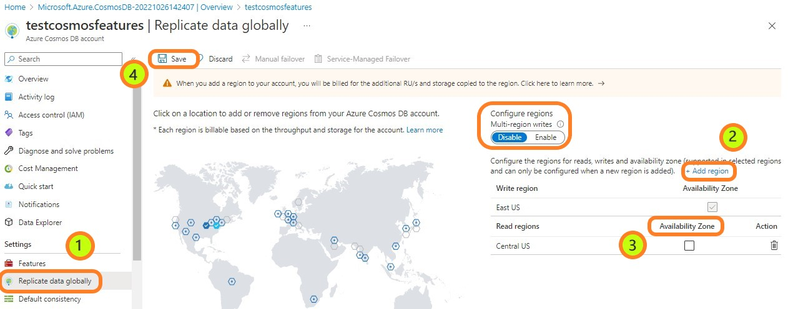

### Region Outages
Region outages refer to outages that affect all Azure Cosmos DB nodes in an Azure region, across all availability 
zones. In the rare cases of region outages, Azure Cosmos DB can be configured to support various outcomes of 
durability and availability

#### Durability: 
To protect against complete data loss that may result from catastrophic disasters in a region, Azure 
Cosmos DB provides continuous and periodic backup modes.  

#### Service-Managed failover: 
It allows Azure Cosmos DB to fail over the write region of multi-region account. Region 
failovers are detected and handled by Azure and do not require any changes from the application.

Select "Service-Managed Failover" option to failover the database to read region at the time region outage.

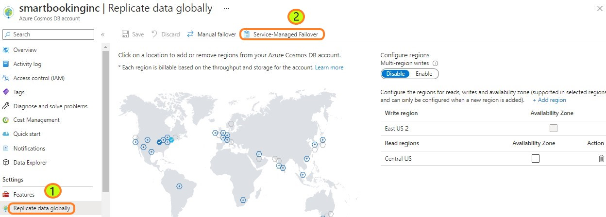

Select the "On" button under "Enable Service-Managed Failover".

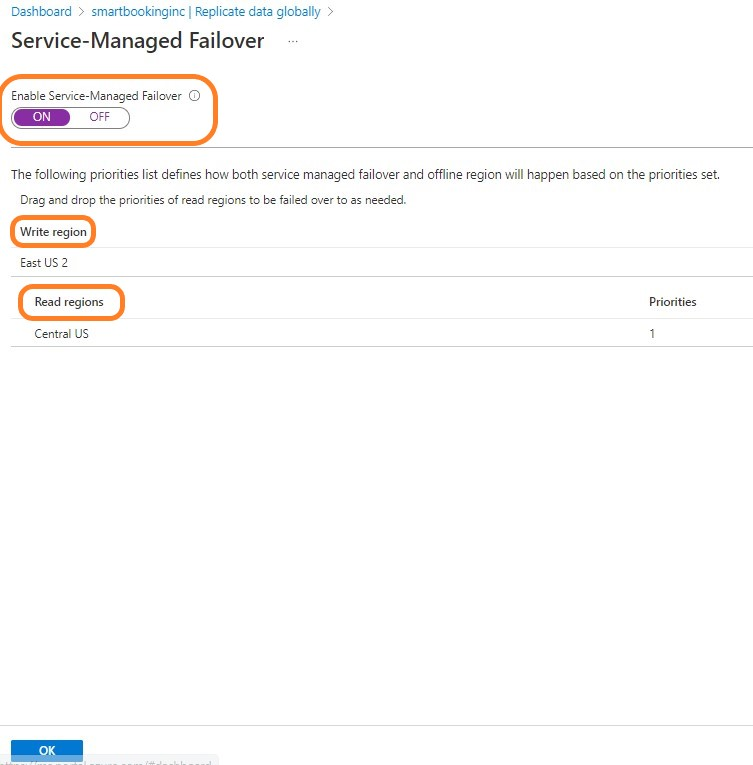

**No action is need for this lab.** It will take sometime to enable the failover option.


### 4.2 Autoscale for scalability
It allows you to scale the throughput (RU/s) of your database or container automatically and instantly. 
The throughput is scaled based on the usage, without impacting the availability, latency, throughput, or 
performance of the workload.

Autoscale provisioned throughput is well suited for mission-critical workloads that have variable or unpredictable 
traffic patterns, and require SLAs on high performance and scale.

Select 'Data Explorer' from the left pane and expand 'SaaS_Multitenant_DB' database. 

Select 'Scale' setting.

Change Max RU/s back to '4000' and select save button if you have not already. 

It will change the throughput instantly without impacting the current workloads.

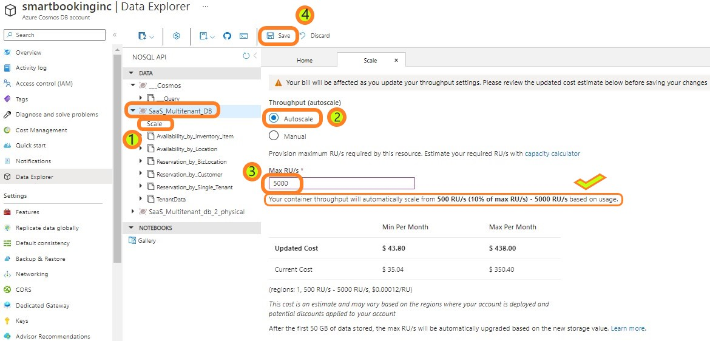

### Sub Millisecond Fast Response Time
Select 'Data Explorer' from the left pane and expand 'SaaS_Multitenant_DB' database.
Select hover over 'Reservation_by_Customer' container and select three dots.
It provide options to create SQL Query, Stored Procedure, UDF & Trigers. Select the 'New SQL Query' option. 

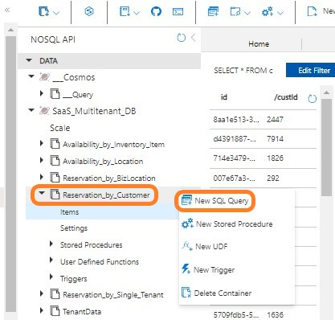

Type the following Query:

```
SELECT * FROM c where c.custId=4691
```

select "Query Stats" and check the Query execution time. It shows the sub millisecond response time.

## Challenge-5: Optimize costs and performance with Indexing Policy
The default indexing policy for newly created containers indexes every property of every item. This allows 
you to get good query performance without having to think about indexing and index management upfront. 
In some situations, you may want to override this automatic behavior to better suit your requirements.

In Azure Cosmos DB, the total consumed storage is the combination of both the Data size and Index size. 
By optimizing the number of paths that are indexed, you can substantially reduce the latency and RU charge 
of write operations.

Will walk you through the steps to include properties required for queries and exculde the rest.

5.1 Expand 'Reservation_by_Customer' container and select 'Settings' section. It will show 'settings' 
and 'indexing Policy' tabs. Select 'indexingPolicy'. It will show you the default policy to index every 
property in the document.

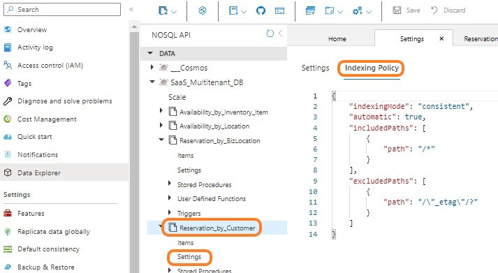


5.2 Identify the properties you would be used most with your application queries. Let us consdier the following 
for our use case:
* creaditCard
* totalAmount
* tenantId
* tBizId
* tBizLocId
* bizName
* tBizAddress/city
* tBizAddress/zipcode

5.3 Set the 'automatic' property value to 'false' and type "/*" as path property value in the excludeedPaths section 
to exclude all the attributes. Enter "/creditCard/?" as the value to the path property in the includedPath section. 
enter "," and copy and paste the section below to enter all the indexing property names.

Your indexing policy should look like the following picture.
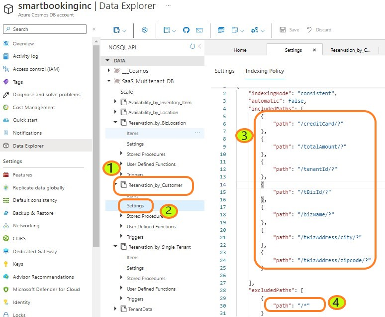


## Challenge-6: Build an application with Cosmos DB as its database 
Cosmos DB is a developer friendly and support SaaS applications with no schema and indexing to manage. It also provides built
in Cache for improved performance.

### Azure Cosmos DB emulator
The Azure Cosmos DB Emulator provides a local environment that emulates the Azure Cosmos DB service for development purposes. 
Using the Azure Cosmos DB Emulator, you can develop and test your application locally, without creating an Azure subscription 
or incurring any costs. When you're satisfied with how your application is working in the Azure Cosmos DB Emulator, you can 
switch to using an Azure Cosmos DB account in the cloud.
6.1 Download the emulator
	[download](https://aka.ms/cosmosdb-emulator) and install the latest version of Azure Cosmos DB Emulator 
	on your local computer. You can develop applications using Azure Cosmos DB Emulator with the account using the APIs for
	NoSQL, Apache Cassandra, Mongo DB, Apache Gremlin and Table. Currently the data explorer in the emulator fully supports
	viewing SQL data only.

#### Requirements to install:
	* Currently Windows Server 2016, 2019 or Windows 10 host OS are supported. The host OS with Active Directory enabled is 
	currently not supported.
	* 64-bit operating system
	* 2-GB RAM
	* 10-GB available hard disk space
	* administrative privileges on the computer. The emulator will add a certificate and also set the firewall rules in order
	to run its services. Therefore admin rights are necessary for the emulator to be able to execute such operations.
	
2) download and quick start

[Clone the Jave App repository] (https://github.com/Azure-Samples/azure-cosmos-java-getting-started)

4) Make changes to connection string and run
5) Verify the changes on Azure environment
6) How does it fit with DevOps

Add instructions to clone the repo to run an application from a local environment.


