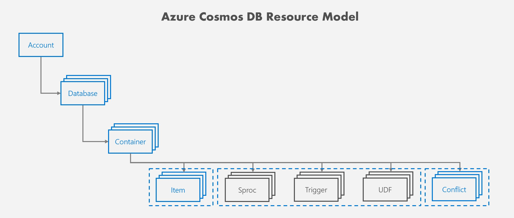
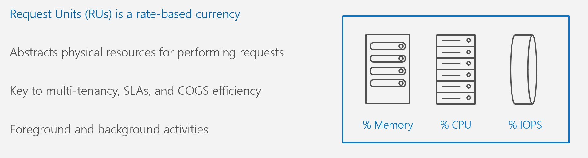
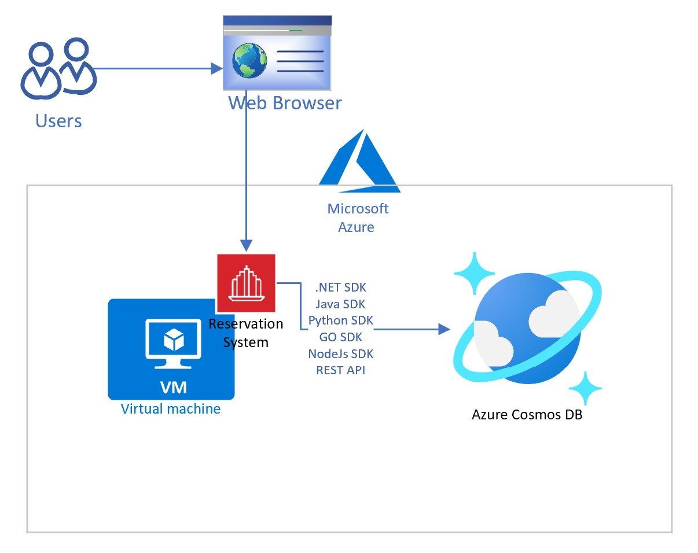
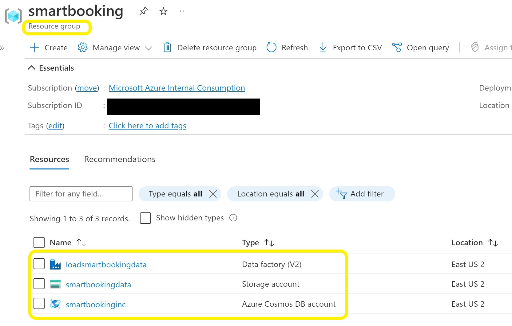
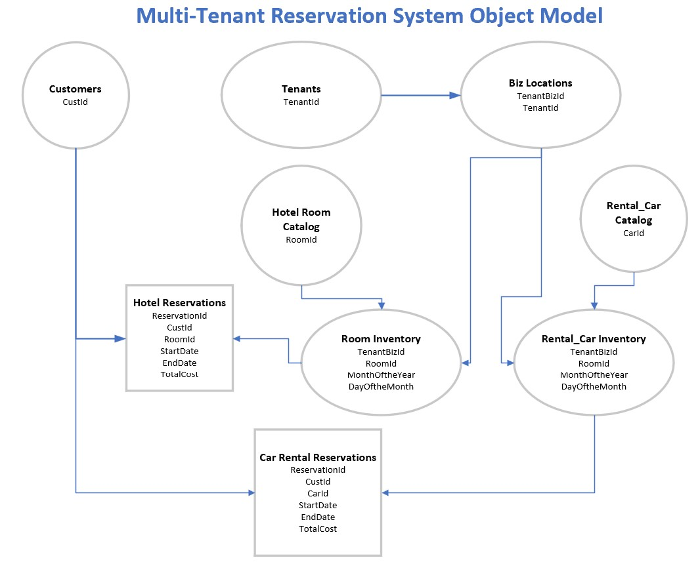
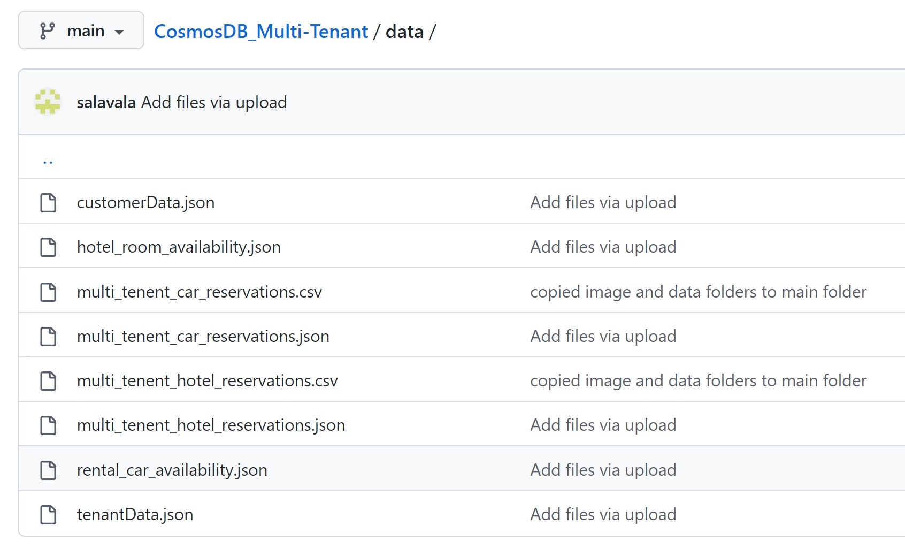
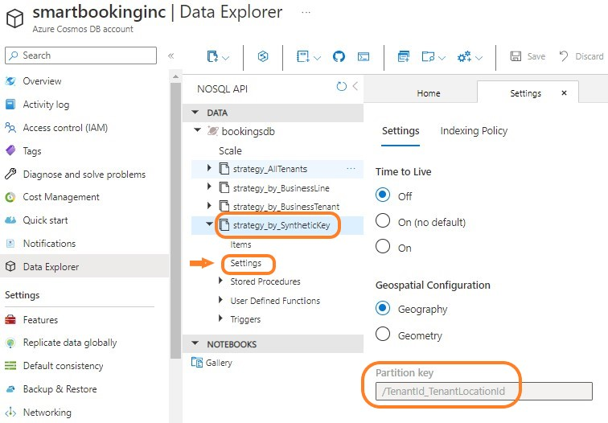

# Azure Cosmos DB for Multitenant Applications Workshop

## Cosmos DB Introduction

Azure Cosmos DB is a fully managed NoSQL database for modern multitenant application development. You can build applications 
fast with open source APIs, multiple SDKs, schemaless data and no-ETL analytics over operational data.
Single-digit millisecond response times, and instant scalability, guarantee speed at any scale.
Guarantee business continuity, 99.999% availability and enterprise-grade security for every application.
End-to-end database management, with serverless and automatic scaling matching your application and TCO needs. 
Supports multiple database APIs including native API for NoSQL, API for Mongo DB, Apache Cassandra, Apache Gremlin and Table.
It also started supporting PostgreSQL extended with the Citus Open Source which is useful for highly scalable relational apps.

To begin using Azure Cosmos DB, create an Azure Cosmos DB account in an Azure resource group in your subscription. 
You then create databases and containers within the account.

A single Azure Cosmos DB account can virtually manage an unlimited amount of data and provisioned throughput. 
To manage your data and provisioned throughput, you can create one or more databases within your account, 
then one or more containers to store your data. 

Request Units: Cost of database operations is normalized by Azure Cosmos DB and is experssed by Request Units (RU). It is a performance 
currency abstracting the system resources such as CPU, IOPS and Memory to perform the database operations supported by 
Azure Cosmos DB. You can examine the response header to track the number of RUs that are consumed by any database 
operation.

## Why Cosmos DB?
Here are the scenarios where Cosmos DB can help:
* Looking to modernize their monolithic onpremise applications as SaaS applications.
* Goals to expand globally with low latency and highly scalable throughput. 
* Trying to reduce costs to support multiple customers with fluctuating throughput requirement.
* Application needs to support multiple businesses with flexible schema.
* Unable to meet performance SLA requirements and reaching max storage limits with growing data.

All the above use cases need a new mindset and special features. This workshop will show you how Cosmos DB will be the best option.

## Workshop Challenge List
- [Challenge-1: Deploy Azure Storage, Azure Cosmos DB & Azure Data Factory Services to Azure Subscription](#challenge-1-Deploy-Azure-Services)
- [Challenge-2: Model data to build SaaS applications](#Challenge-2-Model-data-to-build-SaaS-applications)
- [Challenge-3: Design Cosmos DB Account to serve small, medium and large customers](#Challenge-3-Design-Cosmos-DB-Account-to-serve-small-medium-and-large-customers)
- [Challenge-4: Load multi-tenant data into Cosmos DB with an application](#Challenge-4-Load-multi-tenant-data-into-Cosmos-DB-with-an-application)
- [Challenge-5: Validate Cosmos DB features Partition Key for Multitenancy, Auto Failover for high availability, Autoscale for scalability and Low latency response](#Challenge-5-Validate-Cosmos-DB-features-Partitioning-Auto-failover-Autoscale-and-Low-latency)

## Multi-Tenancy features for Software Companies 

### Distributes Data horizontally
By using partitions with Azure Cosmos DB containers, you can create containers that are shared across multiple tenants. 
With large containers, Azure Cosmos DB spreads your tenants across multiple physical nodes to achieve a high degree of scale.

### Control Throughput based on the size of the customer to lower your costs: 
Typically, you provision a defined number of request units per second for your workload, which is referred 
to as throughput. You can assign throughput at a container level, at a database level to share among the containers, automatically
scale up to the max throughput for address unpredicted workloads and scale down to 10% of Max to save costs.

Access [Azure Cosmos DB Documentation](https://learn.microsoft.com/en-us/azure/cosmos-db/introduction) for more details and training. 

    
## Business Scenario
Fictitious ISV company called "Smart Booking Inc" has built an on-line reservation application called "EasyReserveApp" and 
deployed to Car Rental and Hotel business industries. 

It currently has the following clients in Car Rental and Hotel Industry:

This workshop covers how Azure Cosmos DB can be designed to support small, medium and large customers using this use case..  

## Architecture Solution Diagram
 

## Challenge-1: Deploy Azure Services  

We have developed an Azure Deployment script to provision the required Azure Services used in the above architecture diagram.

1.1 Click the "Deploy to Azure" button

1.2. It display a custom deployment screen as shown below.

	
1.3 Select your region from the dropdown list for example "East US 2".

1.4 Click on "Review+create" button.

1.5 It completes the validation as the next step and click on 'create' button.

It will create the following services in your subscription:
* Azure Cosmos DB with 4 containers

It may take 2 to 5 minutes to create the services.

1.6 Click on "Go to resource group" when the deployment is complete.

It will take you to your resource group showing the installed services.

You have successfully deployed the required services to Azure. Congratulations for completing your first challenge.

## Challenge-2: Model data to build SaaS applications
Let us review the object model for this application and plan the data model for SaaS application.

### Multi-Tenant Reservation System Object Model
"Tenant" object stores all the business customer data
"Biz Locations" contains the tenant business locations address and contact info
"Hotel_Room" contains catalog of rooms details for offering
"Rental_Car" contains catalog of cars details for offering.
"Room_Inventory" maintains availability for each hotel business locations.
"Rental_Car_Inventory" maintains availability for each rental car business locations.
"Customers" maintains all the customer profile data.
"Car_Rental_Reservations" stores all the car rental reservations. 
"Hotel_Reservations" stores all the hotel reservations. 

### Access Patterns
You would want to keep all the relevant data in one object based on the following common access patterns to write and read data.
1) Hotel Room & Rental Car availability to support customer search based on location, dates and room/car types.
2) Update the availability after the customer completes the reservation.
3) Customer reviews the reservation. 
4) Business Owners and Support Team access the reservations for their location. 

You may want to create two document models. One to keep Reservation info and the other one to keep availability info.

* Customer searches for the availability using the availability_doc. 
* Reservation data will be inserted as soon as customer completes the reservation booking. 
* Customers, Hotel Managers, Hotel support team can access the reservation at anytime.

## Challenge-3: Design Cosmos DB Account to serve small, medium and large customers

Access Repo's Data folder and find the following data objects in JSON format.

Check out the CSV files and understand that the flat data does not work for SaaS model.
Think about ways to group the data into the two documents models you have identified. 

### Database Strategies to support small, medium and large customers

#### 1) Shared container with partition keys per tenant
When you use a single container for multiple tenants, you can make use of Azure Cosmos DB partitioning support. 
By using separate partition keys for each tenant, you can easily query the data for a single tenant.
This approach tends to work well when the amount of data stored for each tenant is small. It can be a good choice for 
building a pricing model that includes a free tier, and for business-to-consumer (B2C) solutions. 
In general, by using shared containers, you achieve the highest density of tenants and therefore the lowest price per tenant.

#### 2) Container per tenant
You can provision dedicated containers for each tenant. This can work well for isolating the customer tenant data.
When using a container for each tenant, you can consider sharing throughput with other tenants by provisioning 
throughput at the database level. You can provision dedicated throughput for guaranteed level of performance, serve 
medium size customers, to avoid noisy neighbor problem. 

#### 3) Database account for tenant
You can provision separate database accounts for each tenant, which provides the highest level of isolation, 
but the lowest density. A single database account is dedicated to a tenant, which means they are not subject to 
the noisy neighbor problem. You can also configure the location of the database account according to the 
tenant's requirements, and you can tune the configuration of Azure Cosmos DB features, such as geo-replication 
and customer-managed encryption keys, to suit each tenant's requirements.

#### 4) Hybrid Approaches
You can consider a combination of the above approaches to suit different tenants' requirements and your pricing model. 
For example:
* Provision all free trial customers within a shared container, and use the tenant ID or a synthetic key partition key.
* Offer a paid Bronze tier that deploys a dedicated container per tenant, but with shared throughput on a database.
* Offer a higher Silver tier that provisions dedicated throughput for the tenant's container.
* Offer the highest Gold tier, and provide a dedicated database account for the tenant, which also allows tenants to 
select the geography for their deployment.

### Right strategy to load availability data 
Requirement:
* Support customer client (end customer) search by date, location and inventory type (Rental Car & Hotel Room Type)
* Customer support team from each business should be able to search for availability to help with reservations. 
* Customer manager should be able to load the availability data every month. 

Consider the option of loading the rental car and hotel room data with inventory type as the parition key. Another option 
is to load the data per business location using business location id. 

3.1 Load Rental Car and Hotel Room availability data into 'Availability_by_Inventory_Item' container

3.2 Load Rental Car and Hotel Room availability data into 'Availability_by_BizLocation' container

3.3 Analyze Query performance to satisfy read and write requirement

### Right strategy to load reservation data
* Application need to complete the reservation booking transaction.
* Customer client should be able to review the reservations at anytime. 
* Business support team should be able to pull up the reservation to help the client requests.
* Transaction should be able to update the avilability count. 
* Business manager should be able to pull the total reservations per day 

### Partitioning Strategy to support different indexing requirement for each industry
Azure Cosmos DB provides autoindexing for all attributes in a document. You can limit the indexing attributes to save data storage costs.
You may have different indexing requirement for rental and hotel businesses application queries.
For example reporting may demand to query data based on the room type for hotel data and by car size for rental car data.

You can create separate containers for rental and car industries with 'TenantId' as the partition key. 

3.2 Review 'strategy_by_BusinessLine' container definition designed to load one business line data.
	
	Click-1: Expand 'strategy_by_BusinessLine' container

	Click-2: select 'Settings'

### Partitioning Strategy to support mid size customers
You can partition data based an an unique attribute such as business locationId for each customer to support mid size customers. 
You will have to make sure the data volume of each business location should not exceed 20GB limit of the logical partition size.

3.3 Review the configuration set in the 'Strategy_by_BusinessTenant'container to partition the data by locationId.
	
	Click-1: Expand 'Strategy_by_BusinessTenant' container definition

	Click-2: select 'Settings'

### Partitioning Strategy to combine multiple parameters as a synthetic key: 
It is not easy to find a property with unique values to partition data. You can create composite value by combining properties.
Azure Cosmos DB support synthetic key as a partition key.

3.4 Review the container configuration with Synthetic partition key.
	
	Click-1: Expand 'Strategy_by_SyntheticKey' container

	Click-2: select 'Settings'

Validate the Synthetic partition key.

## Challenge-4: Load multi-tenant data into Cosmos DB with an application

Add instructions to clone the repo to run an application from a local environment.

## Challenge-5: Validate Cosmos DB features Partitioning, Auto failover, Autoscale and Low latency

### 5.1 Partitioning Strategy Validation
Validate the data you have loaded into various containers using the parittion key strategies in Challenge-3. 
You will be Executing the queries in the data explorer to understand the value of partition strategies. 
Plan the partition key to avoid the 20GB logical partition size limit. Physical partition of the container 
can grow horizontally without disrupting the live production environment.  

### Container with tenant partition key
This strategy can be used to support many small size customers and can add as many customers as you need 
to support your business growth.

Select 'Data Explorer' from the left pane and expand 'bookingsdb' database.
Select hover over 'strategy_by_Tenant' container and select three dots.
It provide options to create SQL Query, Stored Procedure, UDF & Trigers. Select the 'New SQL Query' option. 

Type the following Query:

SELECT count(1) as count, c.TenantId FROM c group by c.TenantId

Select "Execute Selection" button from the top tab.

You will 6 logical partitions with number of records per tenant.

select "Query Stats" and note the Request Charge, lookup time and Query execution times.

Execute the following Query:

SELECT count(1) as count, c.BizName from c group by c.BizName
select "Query Stats" and note the Request Charge, lookup time and Query execution times.

Query with tenantId will show better numbers than non-partition key BizName.

### Container per business line with tenant partition key
This strategy can be used to separate data per application or business line to support different throughput, 
indexing requirement.

Select hover over 'strategy_by_BusinessLine' container and select three dots.
It provide options to create SQL Query, Stored Procedure, UDF & Trigers. Select the 'New SQL Query' option. 

Type the following Query:

SELECT count(1) as count, c.TenantId FROM c group by c.TenantId

Select "Execute Selection" button from the top tab.

This container has only Car Rental data. You will only 3 logical partitions with number of records per tenant.

### Container per business address with biz_location partition key
This stategy is used to support the mid size customers with bigger volume than 20GB of data. It creates logical 
parition per business location of each tenant.

Execute the following Query:
SELECT count(1) as count, c.BizLocationId FROM c group by c.BizLocationId

You will get 8 logical partitions keeping the data separate per business location per tenant.

### Container per tenant with tenant business as partition key
This strategy is used to isolate the noisy neighbor from the other mid size customers.

### 5.2 High Availability Features:
Azure Cosmos DB is designed to provide multiple features and configuration options to achieve high availability for all 
solution availability needs.

### Replica Outages
Replica outages refer to outages of individual nodes in an Azure Cosmos DB cluster deployed in an 
Azure region. Azure Cosmos DB automatically mitigates replica outages by guaranteeing at least three replicas of your 
data in each Azure region for your account within a four replica quorum.

### Zone Outages
In many Azure regions, it is possible to distribute your Azure Cosmos DB cluster across 
availability zones, which results increased SLAs, as availability zones are physically separate and provide 
distinct power source, network, and cooling. See Availability Zones. When an Azure Cosmos DB account is 
deployed using availability zones, Azure Cosmos DB provides RTO = 0 and RPO = 0 even in a zone outage.

Select 'Replicate data globally' under 'Settings' section in the left pane. It show all the available regions 
for Cosmos DB deployment. Availability Zone option for the write region can be enabled at the time of account creation.

select "+ Add region" to add a read region. Check the box for 'Availability Zone'.

### Region Outages
Region outages refer to outages that affect all Azure Cosmos DB nodes in an Azure region, across all availability 
zones. In the rare cases of region outages, Azure Cosmos DB can be configured to support various outcomes of 
durability and availability

##Durability: To protect against complete data loss that may result from catastrophic disasters in a region, Azure 
Cosmos DB provides continuous and periodic backup modes.  

### Service-Managed failover: It allows Azure Cosmos DB to fail over the write region of multi-region account. Region 
failovers are detected and handled by Azure and do not require any changes from the application.

Select "Service-Managed Failover" option to failover the database to read region at the time region outage.

Select the "On" button under "Enable Service-Managed Failover".

It will take sometime to enable the failover option.

### 5.3 Autoscale for scalability
It allows you to scale the throughput (RU/s) of your database or container automatically and instantly. 
The throughput is scaled based on the usage, without impacting the availability, latency, throughput, or 
performance of the workload.

Autoscale provisioned throughput is well suited for mission-critical workloads that have variable or unpredictable 
traffic patterns, and require SLAs on high performance and scale.

Select 'Data Explorer' from the left pane and expand 'bookingsdb' database. 

Select 'Scale' setting.

Change Max RU/s to '2000' and select save button.

It will change the throughput instantly without impacting the current workloads.

### Sub Millisecond Fast Response Time
Select 'Data Explorer' from the left pane and expand 'bookingsdb' database.
Select hover over 'strategy_by_Tenant' container and select three dots.
It provide options to create SQL Query, Stored Procedure, UDF & Trigers. Select the 'New SQL Query' option. 

Type the following Query:

SELECT count(1) as count, c.TenantId FROM c group by c.TenantId

select "Query Stats" and check the Query execution time. It shows the sub millisecond response time.

