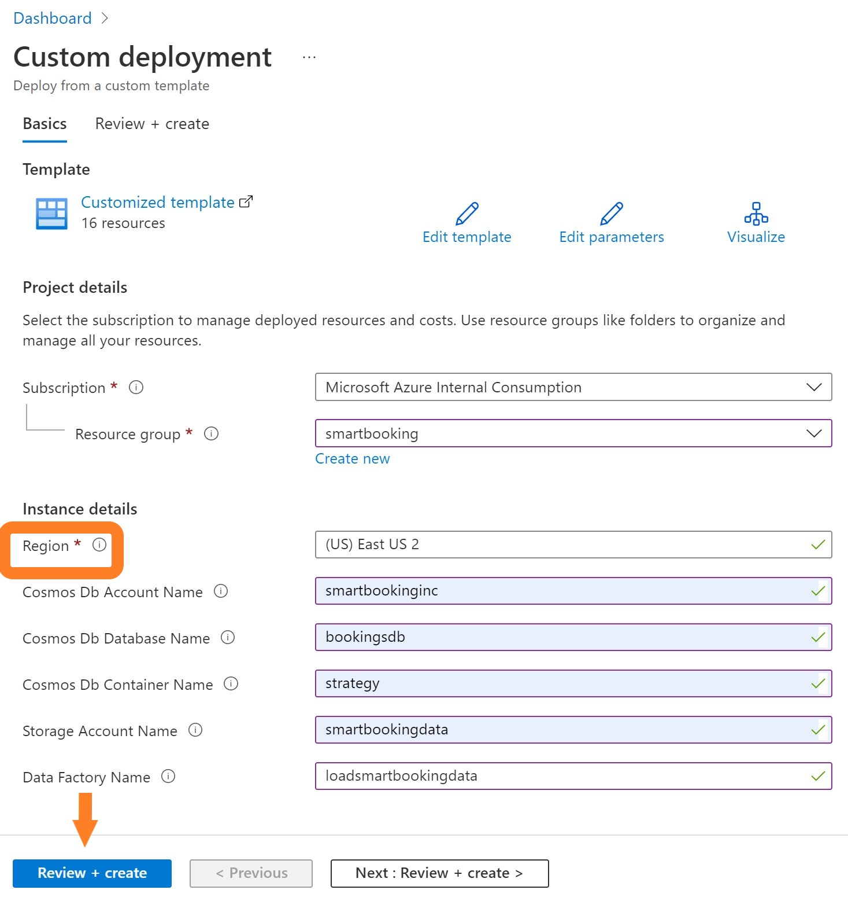
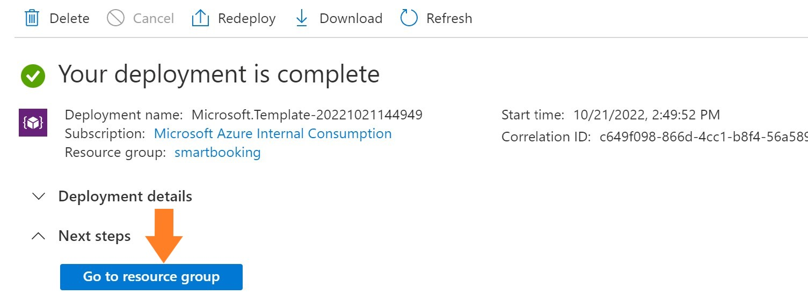
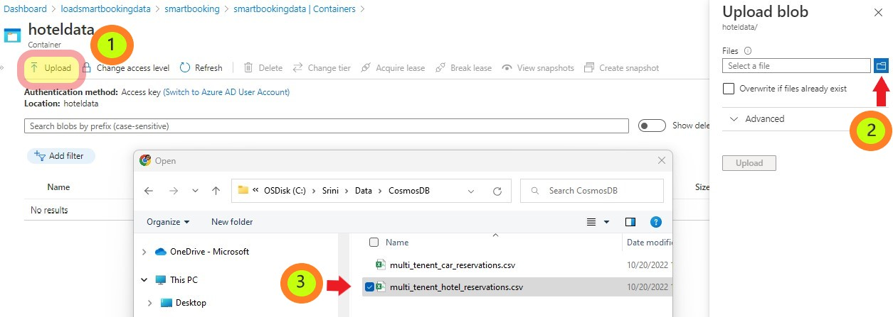
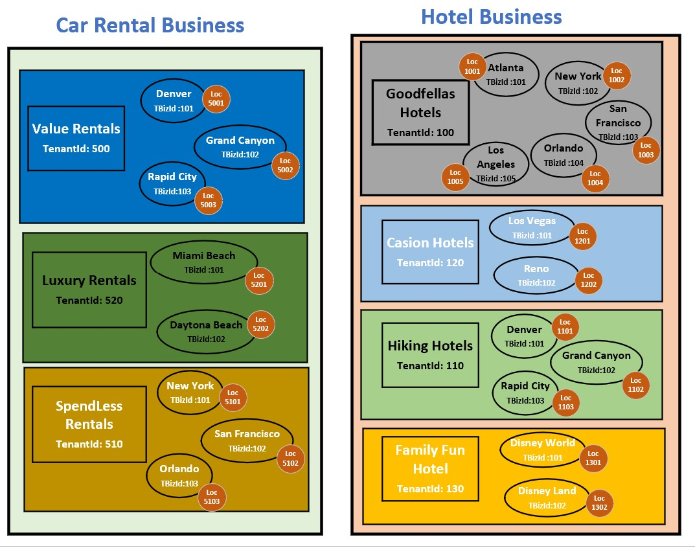
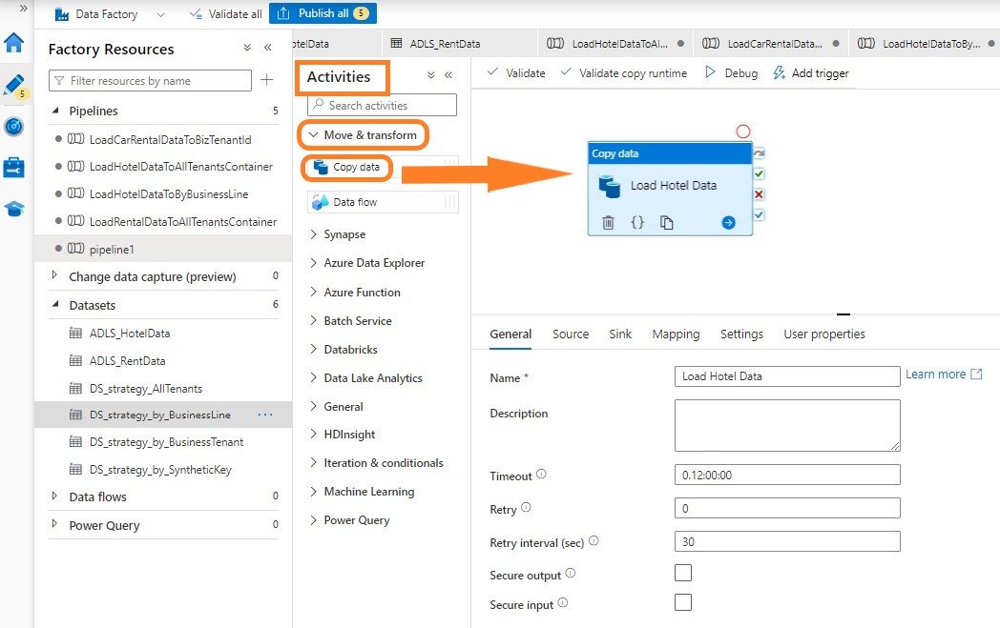
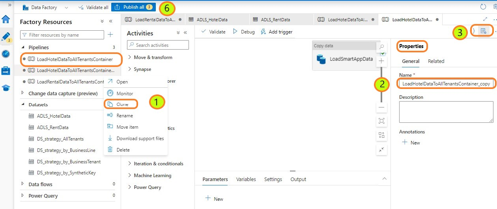

# Azure Cosmos DB for Multitenant Applications Workshop

## Cosmos DB Introduction

Azure Cosmos DB is a fully managed NoSQL database for modern multitenant application development. You can build applications fast with open source APIs, multiple SDKs, schemaless data and no-ETL analytics over operational data.
Single-digit millisecond response times, and instant scalability, guarantee speed at any scale.
Guarantee business continuity, 99.999% availability and enterprise-grade security for every application.
End-to-end database management, with serverless and automatic scaling matching your application and TCO needs.

Supports multiple database APIs including native API for NoSQL, API for Mongo DB, Apache Cassandra, Apache Gremlin and Table.

By using partitions with Azure Cosmos DB containers, you can create containers that are shared across multiple tenants. 
With large containers, Azure Cosmos DB spreads your tenants across multiple physical nodes to achieve a high degree of scale.

Access [Azure Cosmos DB Documentation](https://learn.microsoft.com/en-us/azure/cosmos-db/introduction) for more details and training. 

## Workshop Challenge List
- [Challenge-1: Deploy Azure Storage, Azure Cosmos DB & Azure Data Factory Services to Azure Subscription](#challenge-1-Deploy-Azure-Services)
- [Challenge-2:Load sample multitenant data to Azure Storage Account](#Challenge-2-Load-sample-multitenant-data-to-Azure-Storage-Account)
- [Challenge-3: Design Cosmos DB Account to serve small, medium and large customers](#Challenge-3-Design-Cosmos-DB-Account-to-serve-small,-medium-and-large-customers)
- [Challenge-4: Build ADF Pipelines to load data into Cosmos DB](#Challenge-4-Build-ADF-Pipelines-to-load-data-into-Cosmos-DB)
- [Challenge-5: Validate Cosmos DB features Partition Key, Auto Failover for high availability, Autoscale for scalability and Low latency response](#Challenge-5-Validate-Cosmos-DB-features-Partitioning-Auto-failover-Autoscale-and-Low-latency)
    
## Business Scenario
Fictitious ISV company called ""Smart Booking Inc"" has built an on-line reservation application called "EasyReserveApp" and deployed to Car Rental and Hotel business industries. 

It currently has the following clients:

Car Rental Industry:

**Value Rentals** with offices in Denver, Grand Canyon & Rapid City.

**Luxury Rentals** with offices in Miami Beach & Daytona Beach.

**Spendless** Rentals with offices in New York, San Francisco, Orlando. 

Hotel Industry:

**GoodFellas** Hotels with offices in Atlanta, New York, San Francisco, Orlando, Los Angeles.

**Hiking Hotels** in Denver, Grand Canyon & Rapid City.

**Casino Hotels** in Los Vegas & Reno.

**FamilyFun Hotels** with offices in Disney World & Disney Land.

Let us see how Azure Cosmos DB can be designed to support these small, medium and large customers.  

## Architecture Solution Diagram
 

## Description of other services:
### 1. Azure Data Lake Storage Service Gen2

Azure Blob storage is Microsoft's object storage solution for the cloud. Blob storage is optimized for storing massive 
amounts of unstructured data. Data Lake Storage Gen2 makes Azure Blob Storage the foundation for building enterprise data lakes 
on Azure. Designed from the start to service multiple petabytes of information while sustaining hundreds of gigabits of 
throughput, Data Lake Storage Gen2 allows you to easily manage massive amounts of data.

Access [Azure Data Lake Storage Service](https://learn.microsoft.com/en-us/azure/storage/blobs/data-lake-storage-introduction) 
documentation for more details and training.

### 2. Azure Data Factory (ADF)

Big data requires a service that can orchestrate and operationalize processes to refine these enormous stores of raw data 
into actionable business insights. Azure Data Factory is a managed cloud service that's built for these complex hybrid 
extract-transform-load (ETL), extract-load-transform (ELT), and data integration projects.

Access [Azure Data Factory](https://learn.microsoft.com/en-us/azure/data-factory/introduction) documentation for more details and training. 

## Challenge-1: Deploy Azure Services  

We have developed an Azure Deployment script to provision the required Azure Services used in the above architecture diagram.

1.1 Click the "Deploy to Azure" button

1.2. It display a custom deployment screen as shown below.

	
1.3 Select your region from the dropdown list for example "East US 2".

1.4 Click on "Review+create" button.

1.5 It completes the validation as the next step and click on 'create' button.

It will create the following services in your subscription:
* Azure Cosmos DB with 4 containers
* Azure Data Lake Storage Gen2 with 2 containers
* Azure Data Factory
* Configures Linked Services in ADF for both the Cosmos DB and ADLS Gen2
* Configures Datasets for the 4 Cosmos Db containers and the 2 ADLS containers

It may take 2 to 5 minutes to create the services.

1.6 Click on "Go to resource group" when the deployment is complete.

It will take you to your resource group showing the installed services.

You have successfully deployed the required services to Azure. Congratulations for completing your first challenge.

## Challenge-2: Load sample multitenant data to Azure Storage Account
We have created an anonymous fictitious data to showcase the multitenant data model with this lab. Extract this data
to your environment from the github link.

2.1 Download the EasyReserveApp Multitenant data from the repo 'data'' folder to your laptop folder.

### Load Hotel Reservation Data: 

2.2 Select the Storage Account Service from the Resource group Overview screen (above screen)

2.3 Upload Hotel booking data into hotel storage container.

Click-1: Select Upload button on the hotel data container overview screen.
Click-2: It will open up ""Upload blob"" window and Select the File Folder icon.
Click-3: Browse through your laptop and select the downloaded 'multi_tenent_hotel_reservations.csv' file

You would see csv file in the container after successful upload operation.

### Load Rental Car Reservation Data:

2.4 Select Containers bread crumb and then select 'rentdata' container from the list to upload the sample data.
Repeat the above steps and upload data from 'mult_tenent_car_reservations.csv' file.

You have successfully loaded the sample booking data into a storage account. 

Congratulation, You have completed the second challenge and now you know how to store data in Azure Storage accounts!!

## Challenge-3: Design Cosmos DB Account to serve small, medium and large customers

Review the reservation data for Car and Hotel industries:

**TenantId**: Application has assigned a unique 'tenantId'' for each business entity.

**TenantBizId**: Application has assigned a unique 'tenantBizId' for each of the serving offices with each business entity.

**LocationId**: Application has assigned a unique "LocationId" for each address associated with an operating unit of all businesses. 

### Design Database for small size customers 

Let us assume that all customers are small and did not have lot of volume. Also assume that each query requires the TenantID.
We can create a container with 'TenantId' as the parition key to separate each customer data in a logical partition (bucket). 

3.1 Review the container definition with 'TenantId' as the partition key.
	Click-1: Access Cosmos DB account from the resource group.  

	Click-2: Select Data Explorer from the left pane.

	Click-3: expand 'strategy_AllTenats' container from 'bookingsdb' database

	Click-4: select 'Settings'

You will see the 'TenantId' as the partition key.

### Partitioning Strategy to support different indexing requirement for each industry
Azure Cosmos DB provides autoindexing for all attributes in a document. You can limit the indexing attributes to save data storage costs.
You may have different indexing requirement for rental and hotel businesses application queries.
For example reporting may demand to query data based on the room type for hotel data and by car size for rental car data.

You can create separate containers for rental and car industries with 'TenantId' as the partition key. 

3.2 Review 'strategy_by_BusinessLine' container definition designed to load one business line data.
	
	Click-1: Expand 'strategy_by_BusinessLine' container

	Click-2: select 'Settings'

### Partitioning Strategy to support mid size customers
You can partition data based an an unique attribute such as business locationId for each customer to support mid size customers. 
You will have to make sure the data volume of each business location should not exceed 20GB limit of the logical partition size.

3.3 Review the configuration set in the 'Strategy_by_BusinessTenant'container to partition the data by locationId.
	
	Click-1: Expand 'Strategy_by_BusinessTenant' container definition

	Click-2: select 'Settings'

### Partitioning Strategy to combine multiple parameters as a synthetic key: 
It is not easy to find a property with unique values to partition data. You can create composite value by combining properties.
Azure Cosmos DB support synthetic key as a partition key.

3.4 Review the container configuration with Synthetic partition key.
	
	Click-1: Expand 'Strategy_by_SyntheticKey' container

	Click-2: select 'Settings'

Validate the Synthetic partition key.

## Challenge-4: Build ADF Pipelines to load data into Cosmos DB
Azure Data Factory has many features to fulfil the needs ETL requirement in the cloud. 
You would be experincing just one of many features. 

### Validate the connectivity to Azure Storage and Azure Cosmos DB Database. 

4.1 Validate connectivity to Azure Cosmos DB database	
Click-1: Select Azure Data Factory service from the above picture. It will show you the overview page of the ADF Service.

Click-2: Select "Launch Studio" button to launch the designer studio for building the pipelines.

It will open up "Azure DataFactory Studio"" in a new window tab. 

Click-3: Select "Admin" box as shown in the picture to validate the Data Source Connection(Linked) services

It will take you to the admin page. Select the "linked services"" if it is not selected already. 

Click-4: It will list the data source linked services to Cosmos DB and Storage account.

Click-5: Select Cosmos DB linked Service to test the connectivity.

It will show the edit screen with the connection configuration. You can explore the options to authenticate 
such as "Account Key", "Service Principal", "System Assigned Managed Identity", "User Assigned Managed Identity" 
and access options such as "Cosmos DB Access Key" or ""Azure Key Vault".

Click-6: Click on "Test connection" to verify the connectivity.

### Validate the connectivity to Azure Storage Account.
4.2 Repeat the above steps from click-4 to test the connectivity to the storage account.

### Dataset for loading the Storage Data to Cosmos DB

Deployment script has created 4 Cosmos DB datasets to load data into the containers you have defined in Challenge-3.
It also created 2 Storage Account datasets for Hotel and Rental car data you have uploaded to the storage account. 

4.3 Review the dataset definitions.

Click-1: Select Author (Pencil icon) from the left pane.
Click-2: Expand Datasets under "Factory Resources".
You should see 6 data sources.

Repeat the above steps to add the file name 'multi_tenent_car_reservations.csv' to the Car Rental dataset.

### Create Data Factory Pipelines to load data into Cosmos DB	

You are ready to build the pipeline to load the data into Cosmos DB Containers.

4.5 Create a pipeline to load Hotel Data to All Tenants Container.

Click-1: Select 'Pipelines' under 'Factory Resources' from the left pane.

Click-2: Select three dots indicting the pipeline actions and select 'New Pipeline'.

Click-3: Type a name to the pipeline in the right 'Properties' pane. For example: LoadHotelDataToAllTenantsContainer. 

Click-4: Close the 'Properties' pane by selecting page with start icon on the top of the pane.

Click-5: Expand 'Move & transform' section under 'Activities' pane in the right next to 'Factory Resources'.

Click-6: Drag 'Copy Data' box to the right empty box.

Click-7: Type 'Load Hotel Data' as a name to this activity.

Click-8: Select Source tab and select 'ADLS_HotelData' from the dropdown 'Source dataset' parameter. 
You can see various options to improve the performance to read the data.

Click-9: Select Sink Tab and select 'DS_Strategy_AllTenants' from the dropdown 'Sink dataset' parameter.
Review all the options to improve the performance to write the data.

Click-10: Review 'Settings' to view data factory execute options. 

Click-11: Select 'Publish all' icon with an yellow circle showing the number of changes and publish the changes.

### 4.6 Create a pipeline to load Rental Car data into All Tenenats Container.

Data Factory Studio has a feature to clone a pipeline. 

Click-1: Hover over 'LoadHotelDataToAllTenantsContainer' pipeline and select actions to a list. 

Click-2: Select 'Clone' option. Rename LoadHotelDataToAllTenantsContainer_copy1 to LoadRentalCarDataToAllTenantsContainer.

Click-3: Close the properties box by selecting Page icon at the top right.

Click-4: Select 'Source' tab and select 'ADLS_RentalData'

Click-5: Select 'Sink' tab and select 'DS_Strategy_AllTenants' from the dropdown.

Click-6: Select 'Publish all' to save the new pipeline.

### 4.7 Create a pipeline to load Rental Car Data into data By Business Line Container.

Repeat the above step with 'ADLS_RentalData' as the source dataset and  'DS_strategy_by_BusinessLine' as the sink dataset.

### 4.8 Create a pipeline to load Rental Car Data into data By Tenant Business Container.

Repeat the above step with 'ADLS_RentalData' as the source dataset and  'DS_strategy_by_BusinessTenant' as the sink dataset.

### 4.9 Create a pipeline to load Rental Car Data into data By Synthetic Key Container.

Repeat the above step with 'ADLS_RentalData' as the source dataset and  'DS_strategy_by_SyntheticKey' as the sink dataset.

Congratullations! You have successfully completed Challenge-4!!

## Challenge-5: Validate Cosmos DB features Partitioning, Auto failover, Autoscale and Low latency

### 5.1 Partitioning Strategy Validation
Validate the data you have loaded into various containers using the parittion key strategies in Challenge-3. 
You will be Executing the queries in the data explorer to understand the value of partition strategies. 
Plan the partition key to avoid the 20GB logical partition size limit. Physical partition of the container 
can grow horizontally without disrupting the live production environment.  

### Container with tenant partition key
This strategy can be used to support many small size customers and can add as many customers as you need 
to support your business growth.

Select 'Data Explorer' from the left pane and expand 'bookingsdb' database.
Select hover over 'strategy_by_Tenant' container and select three dots.
It provide options to create SQL Query, Stored Procedure, UDF & Trigers. Select the 'New SQL Query' option. 

Type the following Query:

SELECT count(1) as count, c.TenantId FROM c group by c.TenantId

Select "Execute Selection" button from the top tab.

You will 6 logical partitions with number of records per tenant.

select "Query Stats" and note the Request Charge, lookup time and Query execution times.

Execute the following Query:

SELECT count(1) as count, c.BizName from c group by c.BizName
select "Query Stats" and note the Request Charge, lookup time and Query execution times.

Query with tenantId will show better numbers than non-partition key BizName.

### Container per business line with tenant partition key
This strategy can be used to separate data per application or business line to support different throughput, 
indexing requirement.

Select hover over 'strategy_by_BusinessLine' container and select three dots.
It provide options to create SQL Query, Stored Procedure, UDF & Trigers. Select the 'New SQL Query' option. 

Type the following Query:

SELECT count(1) as count, c.TenantId FROM c group by c.TenantId

Select "Execute Selection" button from the top tab.

This container has only Car Rental data. You will only 3 logical partitions with number of records per tenant.

### Container per business address with biz_location partition key
This stategy is used to support the mid size customers with bigger volume than 20GB of data. It creates logical 
parition per business location of each tenant.

Execute the following Query:
SELECT count(1) as count, c.BizLocationId FROM c group by c.BizLocationId

You will get 8 logical partitions keeping the data separate per business location per tenant.

### Container per tenant with tenant business as partition key
This strategy is used to isolate the noisy neighbor from the other mid size customers.

### 5.2 High Availability Features:
Azure Cosmos DB is designed to provide multiple features and configuration options to achieve high availability for all 
solution availability needs.

### Replica Outages
Replica outages refer to outages of individual nodes in an Azure Cosmos DB cluster deployed in an 
Azure region. Azure Cosmos DB automatically mitigates replica outages by guaranteeing at least three replicas of your 
data in each Azure region for your account within a four replica quorum.

### Zone Outages
In many Azure regions, it is possible to distribute your Azure Cosmos DB cluster across 
availability zones, which results increased SLAs, as availability zones are physically separate and provide 
distinct power source, network, and cooling. See Availability Zones. When an Azure Cosmos DB account is 
deployed using availability zones, Azure Cosmos DB provides RTO = 0 and RPO = 0 even in a zone outage.

Select 'Replicate data globally' under 'Settings' section in the left pane. It show all the available regions 
for Cosmos DB deployment. Availability Zone option for the write region can be enabled at the time of account creation.

select "+ Add region" to add a read region. Check the box for 'Availability Zone'.

### Region Outages
Region outages refer to outages that affect all Azure Cosmos DB nodes in an Azure region, across all availability 
zones. In the rare cases of region outages, Azure Cosmos DB can be configured to support various outcomes of 
durability and availability

##Durability: To protect against complete data loss that may result from catastrophic disasters in a region, Azure 
Cosmos DB provides continuous and periodic backup modes.  

### Service-Managed failover: It allows Azure Cosmos DB to fail over the write region of multi-region account. Region 
failovers are detected and handled by Azure and do not require any changes from the application.

Select "Service-Managed Failover" option to failover the database to read region at the time region outage.

Select the "On" button under "Enable Service-Managed Failover".

It will take sometime to enable the failover option.

### 5.3 Autoscale for scalability
It allows you to scale the throughput (RU/s) of your database or container automatically and instantly. 
The throughput is scaled based on the usage, without impacting the availability, latency, throughput, or 
performance of the workload.

Autoscale provisioned throughput is well suited for mission-critical workloads that have variable or unpredictable 
traffic patterns, and require SLAs on high performance and scale.

Select 'Data Explorer' from the left pane and expand 'bookingsdb' database. 

Select 'Scale' setting.

Change Max RU/s to '2000' and select save button.

It will change the throughput instantly without impacting the current workloads.

### Sub Millisecond Fast Response Time
Select 'Data Explorer' from the left pane and expand 'bookingsdb' database.
Select hover over 'strategy_by_Tenant' container and select three dots.
It provide options to create SQL Query, Stored Procedure, UDF & Trigers. Select the 'New SQL Query' option. 

Type the following Query:

SELECT count(1) as count, c.TenantId FROM c group by c.TenantId

select "Query Stats" and check the Query execution time. It shows the sub millisecond response time.

